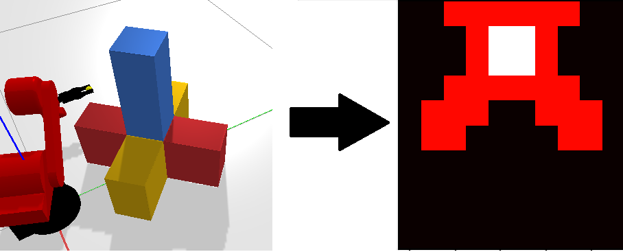
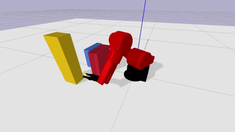

## Fred the robot arm

Table of Contents
-----------------
  * [Obstacle avoidance with reinforcement learning](#Obstacle-avoidance-with-reinforcement-learning)
  * [Algorithm details](#Algorithm-details)
  * [Deploying in the real world with machine vision](#Deploying-in-the-real-world-with-machine-vision)
  * [Inverse kinematics](#Inverse-kinematics)
  * [Record and play back with a controller](#Record-and-play-back-with-a-controller)

## Obstacle avoidance with reinforcement learning
Using deep reinforcement learning the robot can reach the goal whilst avoiding obstacles, it even outperforms a classical method (gradient descent). 

Gradient descent (left) vs trained agent (right):

  
  

With gradient descent the robot simply gets stuck. The trained agent manages to complete the task and can even be deployed on a real robot:

## Algorithm details
The goal is to get the robot to move from point A to point B without bumping into obstacles. 
A classical method is to use workspace potential fields and gradient descent, which is just a fancy name for 
pulling the robot towards the target and pushing it away from obstacles. However, the robot can get stuck when the net force is zero. 
The input for the gradient descent algorithm are 2 types of vectors: attractive vectors pointing towards the goal position and repulsive vectors pointing away from obstacles. 
These vectors originate from control points that have to be chosen manually:

If the net force on the robot is zero it gets stuck. I cannot "see" the obstacle except when it gets close to it.

This is where the idea of using reinforcement learning came from. We can give the agent the same inputs as gradient descent, 
but we can also make it aware of its current position and obstacles it's about to face, both their size and location. 
In theory, it could then plan its movement ahead and avoid the obstacle without getting stuck. The idea is to take the obstacles 
and turn them into an occupancy grid which is then fed into the network as an image using convolutional filters 
(here color corresponds to the height of the obstacle):

The attractive vectors, repulsive vectors, current location and the occupancy grid should be all the information needed to reach the goal, and it turns out it is.
The specific algorithm used here is the soft actor critic method ([Soft Actor Critic__ Haarnoja et al., 2018](https://arxiv.org/abs/1812.05905)).

The agent controls the robot by updating its target position and orientation (pose). Giving the agent direct control over the angels of the robot would mean it has to figure out inverse kinematics as well, but since I have the algorithm for inverse kinematics there is no need for this.
This does mean however that the movement generated by the agent looks a little jagged, so the output of the agent is then used to generate a nice smooth curve using a B-spline:

Raw movement (left) vs smoothed movement (right):

  
  

Here is the agent solving all the training scenarios:

  
  

Finally a few examples of the agent solving scenarios that were not part of the training set:

## Deploying in the real world with machine vision
After converting the agent's output to a B-spline we have a simple path the robot has to follow. 
The hard part is converting the obstacles in the real world to the digital world. 
This is achieved by using machine vision, specifically opencv with the 
[aruco library](https://docs.opencv.org/4.5.2/d5/dae/tutorial_aruco_detection.html).
With the aruco library it is then possible to get the relative position and rotation of the markers and the board relative 
to the camera. Using linear algebra it is then trivial to get the position of the markers relative to the board. 
The board is at a known position relative to the robot which means we now know the position of the markers with respect 
to the robot, because each marker has a unique ID I have simply hard coded which obstacle is attached to which marker. 
For example marker 29 is a box of 12 by 12 by 35 centimeters. The camera image is then transformed:

## Inverse kinematics
The inverse kinematics is based on chapter 2 of "Lorenzo Sciavicco and Bruno Siciliano. Modelling and control of robot
manipulators. Springer Science & Business Media, 2012." For the mathematical details of the inverse kinematics of this robot see [ik_documentation.pdf](documentation/ik_documentation.pdf)

## Record and play back with a controller
Using inverse kinematics and B-spline path planning it's easy to program a path for the robot using a controller:

## Reinforcement learning training with docker
If you want to save yourself the pain of installing cuda, there is always docker. 

Training instructions:

build with: docker build -t thomas137/sac -f SaCDockerFile .

Run with:
docker run -it --gpus all --rm -v /home/thomas/PycharmProjects/fred/src:/tf/src   thomas137/sac

once in docker:
python src/reinforcementlearning/softActorCritic/soft_actor_critic.py --root_dir=test

░░░░░░░█▐▓▓░████▄▄▄█▀▄▓▓▓▌█ Epic code  
░░░░░▄█▌▀▄▓▓▄▄▄▄▀▀▀▄▓▓▓▓▓▌█  
░░░▄█▀▀▄▓█▓▓▓▓▓▓▓▓▓▓▓▓▀░▓▌█  
░░█▀▄▓▓▓███▓▓▓███▓▓▓▄░░▄▓▐█▌ level is so high  
░█▌▓▓▓▀▀▓▓▓▓███▓▓▓▓▓▓▓▄▀▓▓▐█  
▐█▐██▐░▄▓▓▓▓▓▀▄░▀▓▓▓▓▓▓▓▓▓▌█▌  
█▌███▓▓▓▓▓▓▓▓▐░░▄▓▓███▓▓▓▄▀▐█ much quality  
█▐█▓▀░░▀▓▓▓▓▓▓▓▓▓██████▓▓▓▓▐█  
▌▓▄▌▀░▀░▐▀█▄▓▓██████████▓▓▓▌█▌  
▌▓▓▓▄▄▀▀▓▓▓▀▓▓▓▓▓▓▓▓█▓█▓█▓▓▌█▌ Wow.  
█▐▓▓▓▓▓▓▄▄▄▓▓▓▓▓▓█▓█▓█▓█▓▓▓▐█  
