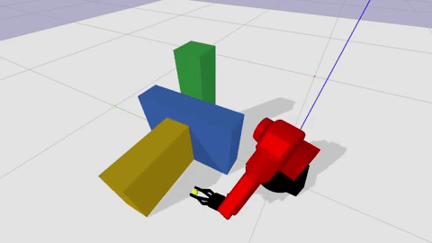

## Fred the robot arm

# Obstacle avoidance with reinforcement learning
The goal is to get the robot to move from point A to point B without bumping into obstacles. A classical method is to use workspace potential fields and gradient descent, which is just a fancy name for pulling the robot towards the target and pushing it away from obstacles. However the robot can get stuck when the net force is zero.

The idea is to train an agent using reinforcement learning to perform this task instead. The method used here is the soft actor critic method ([Soft Actor Critic__ Haarnoja et al., 2018](https://arxiv.org/abs/1812.05905)). As demonstraded below, the trained agent can solve scenarios which gradient descent cannot.

Gradient descent (left) vs trained agent (right):

With gradient descent the robot simply gets stuck. With the help of the trained agent a smooth path is found to the goal. But what's the fun of doing this only in a simulation? Can this be deployed to an actual robot arm? Of course:

# Reinforcement learning training with docker
Training instructions:

build with: docker build -t thomas137/sac -f SaCDockerFile .

Run with:
docker run -it --gpus all --rm -v /home/thomas/PycharmProjects/fred/src:/tf/src   thomas137/sac

once in docker:
python src/reinforcementlearning/softActorCritic/soft_actor_critic.py --root_dir=test